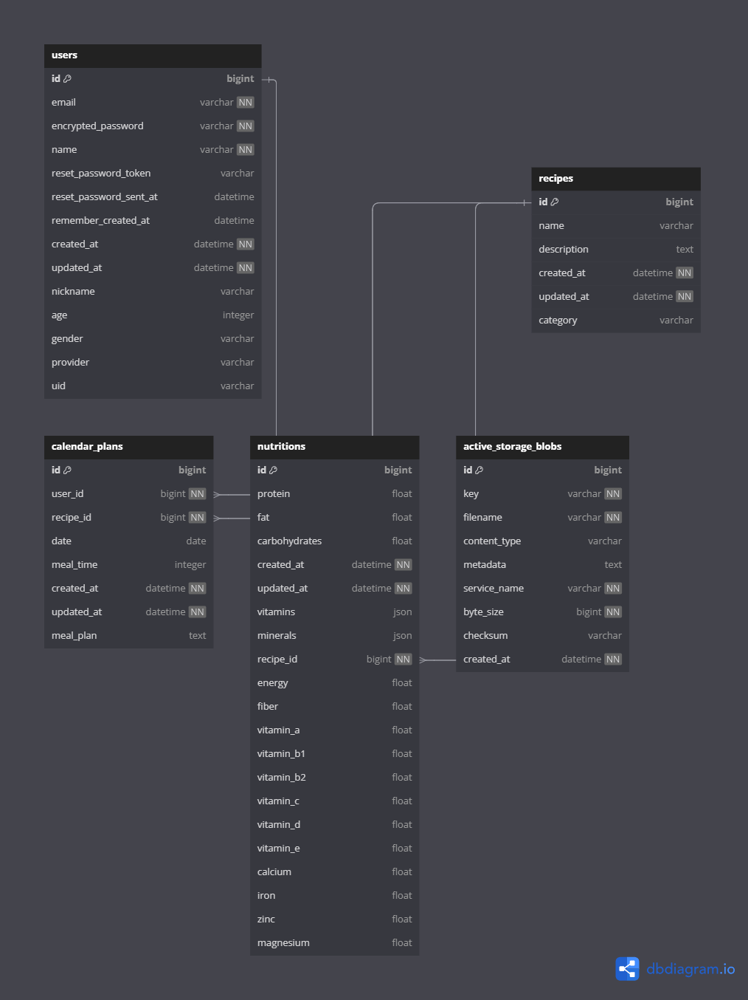

# プロジェクト名：『アイめし』
 
 

## サービスURL
### https://eyemeshi.com/ 

## サービス概要

～ あなたの食卓を彩る。栄養バランスを可視化するAI献立提案サービス ～ 
 
『アイめし』は、栄養素を選択するだけでAIが最適な献立を自動生成し、栄養バランスをグラフで可視化できるサービスです。 
生成された献立はカレンダーで管理でき、SNSでシェアすることも可能です。 
毎日の献立作りの悩みを解消し、健康的な食生活をサポートすることで、忙しい現代人の食卓に彩りを加えるサービスとなっています。

## サービス開発の背景

私自身、仕事や育児等で忙しい中で、「今日は何を作ろう」という悩みを抱えてきました。同じような悩みを持つ友人や家族も多く、健康的な食事を提供したいという思いがありながらも、時間や知識の制約から理想的な献立作りが難しいという声をよく耳にしていました。 
そこで私は、「献立選びの負担を減らしたい！栄養バランスを意識した食事を簡単に！」という方々のために、AI献立提案アプリを開発することにしました。 
まず私は、なぜ理想的な献立づくりが難しいのか、その原因を考え、それらを解決できるアプリを開発することにしました。下記の内容が、私が考える献立作りの困難さの主な原因です。

- 毎日の献立を考えるのは想像以上に時間と労力を要する
- 栄養バランスを考慮した食事づくりには専門的な知識が必要
- 献立の繰り返しによるマンネリ化で料理へのモチベーションが低下する
- 栄養摂取の記録や管理が面倒で継続しにくい

これらの課題を解決するアプリ、それが『アイめし』です。AIが栄養バランスを考慮した献立を自動提案し、カレンダーでの管理や栄養の可視化機能により、毎日の食事づくりをもっと簡単に、そして健康的にします。

## ユーザー層について

- 忙しい主婦・主夫
- 共働き家庭
- 料理初心者
- 栄養バランスを意識したい健康志向の方
- 献立作りに悩む単身者

## サービスの利用イメージ

1. ユーザーがアプリにログインし、献立を作成したい日付と食事時間（朝・昼・夜）を選択
2. 重視したい栄養素（タンパク質、ビタミンなど）や料理カテゴリー（和食・洋食・中華）を選択
3. AIが最適な献立（主菜・副菜）を自動生成
4. 気に入った献立をカレンダーに保存
5. 栄養バランスをグラフで確認
6. 献立をSNSでシェアすることも可能

## ユーザーの獲得について

- SNS（Instagram、X）での献立シェア機能による口コミ拡散
- 料理・育児関連のコミュニティでのプロモーション

## サービスの差別化ポイント・推しポイント

- AI技術による栄養バランスに特化した献立提案
- シンプルな操作でプロ並みの献立作成が可能
- カレンダー機能による献立の長期管理
- 栄養摂取の可視化によるヘルスケアサポート
- SNSシェア機能でコミュニティ形成

## 機能紹介

| ユーザー登録 / ログイン |
| :---: | 
|  |
| 
『アカウント名』『ニックネーム』『メールアドレス』『パスワード』『確認用パスワード』を入力してユーザー登録を行います。プロフィール画像も設定可能です。ユーザー登録後は、自動的にログイン処理が行われるようになっており、そのまま直ぐにサービスを利用する事が出来ます。 また、Googleアカウントを用いてGoogleログインを行う事も可能です。
 |
 

| 献立作成機能 |
| :---: | 
|  |
| 
栄養素を選択し『献立を生成する』ボタンをクリックするだけで、AIが最適な献立を自動生成します。主菜と副菜のバランスを考慮した献立を提案し、和食・洋食・中華など料理のカテゴリーも指定できます。 栄養バランスをグラフで可視化するため、健康的な食生活をサポートします。
 |
 

| カレンダー管理機能 |
| :---: | 
|  |
| 
生成した献立をカレンダーで管理できます。月別表示で朝・昼・夜の献立を一覧でき、過去の献立も簡単に確認できます。献立の追加・削除も直感的な操作で行えるため、長期的な食事計画が立てやすくなっています。
 |
 

| 栄養可視化機能 |
| :---: | 
|  |
| 
摂取した栄養素をグラフで可視化します。タンパク質、脂質、炭水化物などの主要栄養素や、ビタミン・ミネラルの摂取状況を確認できます。期間を指定することで、長期的な栄養バランスの傾向も分析可能です。
 |
 

| シェア機能 |
| :---: | 
|  |
| 
生成した献立をXで簡単にシェアできます。シェアすることで、友人や家族と健康的な食生活の情報を共有し、モチベーション維持にも役立ちます。
 |
 

## 使用技術
| カテゴリ | 技術内容 |
| --- | --- | 
| サーバーサイド | Ruby on Rails・Ruby |
| フロントエンド | Ruby on Rails・JavaScript |
| CSSフレームワーク | Tailwindcss |
| Web API | OpenAI API(GPT-4)・Google OAuth API |
| データベースサーバー | PostgreSQL |
| ファイルサーバー | Active Storage (Local) |
| アプリケーションサーバー | Render |
| バージョン管理ツール | GitHub・Git Flow |
 

## 画面遷移図

- [Figma 画面遷移図](https://www.figma.com/design/0cojSDS4xJ1ybwfGGIWLzH/%E3%83%91%E3%82%AF%E3%83%A9%E3%82%AF?node-id=8-2743&node-type=frame&t=21CuoaJOQqYR9uaC-0)

## ER 図

